# Phase 1: Data Ingestion Service Testing Guide

## Overview

This guide walks you through testing the newly extracted Data Ingestion Service, which is the first microservice in our transformation from monolith to microservices architecture.

## Architecture Changes

### What We've Built
- **Standalone Data Ingestion Service**: Extracted USGS earthquake ingestion from monolith
- **Kafka Event Streaming**: Raw and processed disaster events published to Kafka topics
- **Prometheus Monitoring**: Comprehensive metrics for ingestion performance and health
- **Generic Domain Model**: Extensible to support multiple disaster types

### What Was Extracted from Monolith
- **USGS API Integration**: External data fetching and processing logic
- **Data Transformation**: Converting USGS GeoJSON to internal domain models
- **Scheduled Ingestion**: Automated data collection jobs (5min/15min/1hr intervals)
- **Event Publishing**: Publishing structured events to Kafka topics

### What Remains in Monolith (Untouched)
- **Database CRUD Operations**: PostgreSQL storage and querying
- **API Endpoints**: `/earthquakes/` REST endpoints for data access
- **Authentication & Authorization**: User management and JWT tokens
- **Real-time Features**: WebSocket connections for live updates
- **Business Logic**: Earthquake-specific calculations and assessments

### Current State: Parallel Systems
**Important**: The monolith and microservice currently run **independently**:
- **Monolith**: Continues normal operation (still ingests data, serves APIs, stores in database)
- **Data Ingestion Service**: Publishes events to Kafka topics for future phases
- **No Integration**: Events are stored in Kafka but not yet consumed by monolith
- **Strategy**: Service-by-service extraction in future phases (Phase 2, 3, etc.)

## System Architecture & Data Flow

```mermaid
graph TB
    %% External Systems
    USGS[🌍 USGS API<br/>earthquake.usgs.gov]

    %% Data Ingestion Service Components
    subgraph "🔧 Data Ingestion Service (Port 8000)"
        API[📡 FastAPI<br/>REST Endpoints]
        SCHEDULER[⏰ APScheduler<br/>5min/15min/1hr]
        USGS_CLIENT[🔌 USGS Client<br/>HTTP Requests]
        PROCESSOR[⚙️ Event Processor<br/>Domain Transformation]
        KAFKA_PROD[📤 Kafka Producer<br/>Event Publishing]
        METRICS[📊 Metrics Export<br/>/metrics endpoint]
    end

    %% Kafka Infrastructure
    subgraph "🚀 Kafka Cluster (ndgms-local)"
        KAFKA_BROKER[🗄️ Kafka Broker<br/>Port 9092]
        TOPICS[📂 Topics:<br/>• disasters.raw.earthquake<br/>• disasters.processed.earthquake]
    end

    %% Monitoring Stack
    subgraph "📊 Monitoring & UI"
        KAFKA_UI[🖥️ Kafka UI<br/>Port 8080<br/>Topic Management]
        PROMETHEUS[📈 Prometheus<br/>Port 9090<br/>Metrics Collection]
        GRAFANA[📱 Grafana<br/>Port 3000<br/>Dashboards]
    end

    %% Monolith (unchanged)
    subgraph "🏛️ Original Monolith (Unchanged)"
        MONOLITH[earthquake-monitor<br/>PostgreSQL + APIs<br/>WebSocket + Auth]
    end

    %% Data Flow Arrows
    USGS -->|GeoJSON Data| USGS_CLIENT
    SCHEDULER -->|Triggers Jobs| USGS_CLIENT
    API -->|Manual Triggers| USGS_CLIENT
    USGS_CLIENT -->|Raw Data| PROCESSOR
    PROCESSOR -->|Domain Events| KAFKA_PROD
    KAFKA_PROD -->|Publishes| KAFKA_BROKER
    KAFKA_BROKER -->|Stores| TOPICS

    %% Monitoring Connections
    API -->|Exposes| METRICS
    PROMETHEUS -->|Scrapes| METRICS
    PROMETHEUS -->|Data Source| GRAFANA
    KAFKA_UI -->|Connects| KAFKA_BROKER


    %% Styling
    classDef serviceBox fill:#e1f5fe,stroke:#01579b,stroke-width:2px
    classDef kafkaBox fill:#f3e5f5,stroke:#4a148c,stroke-width:2px
    classDef monitorBox fill:#e8f5e8,stroke:#1b5e20,stroke-width:2px
    classDef monolithBox fill:#fff3e0,stroke:#e65100,stroke-width:2px
    classDef externalBox fill:#fce4ec,stroke:#880e4f,stroke-width:2px

    class API,SCHEDULER,USGS_CLIENT,PROCESSOR,KAFKA_PROD,METRICS serviceBox
    class KAFKA_BROKER,TOPICS kafkaBox
    class KAFKA_UI,PROMETHEUS,GRAFANA monitorBox
    class MONOLITH monolithBox
    class USGS externalBox
```



### Data Flow Explanation

1. **🌍 Data Collection**: USGS API provides real-time earthquake GeoJSON data
2. **⏰ Automated Ingestion**: Scheduler triggers jobs every 5/15/60 minutes
3. **📡 Manual Triggers**: REST API allows on-demand ingestion
4. **⚙️ Processing**: Raw USGS data transformed into domain events
5. **📤 Event Publishing**: Dual publishing to raw and processed Kafka topics
6. **🗄️ Event Storage**: Kafka broker persists events for future consumers
7. **📊 Monitoring**: Prometheus scrapes metrics, Grafana visualizes dashboards
8. **🖥️ Management**: Kafka UI provides topic browsing and message inspection

**Key Insight**: Events flow into Kafka topics but are not yet consumed - they await future microservices in Phase 2+.

### Topics Created
```
disasters.raw.earthquake      # Raw USGS earthquake data
disasters.processed.earthquake # Processed earthquake events ready for consumption
```

### Metrics Available
- `usgs_api_requests_total` - USGS API request counts by status
- `disaster_events_processed_total` - Events processed by stage
- `kafka_messages_sent_total` - Kafka publishing success/error rates
- `ingestion_jobs_total` - Ingestion job success/failure counts
- `active_ingestion_jobs` - Currently running ingestion jobs

## Testing Steps

### 1. Start Infrastructure

```bash
# Start Kafka, monitoring, and data ingestion service
docker-compose -f docker-compose.phase1.yml up -d

# Check all services are healthy
docker-compose -f docker-compose.phase1.yml ps
```

### 2. Verify Service Health

```bash
# Check data ingestion service health
curl http://localhost:8000/health

# Expected response:
{
  "status": "healthy",
  "services": {
    "usgs": {"status": "healthy", "feeds_available": 16},
    "kafka": {"status": "healthy"}
  }
}
```

### 3. Trigger Manual Ingestion

```bash
# Fetch significant earthquakes from the last day
curl -X POST "http://localhost:8000/ingest/usgs?period=day&magnitude=significant"

# Expected response:
{
  "status": "success",
  "result": {
    "total_fetched": 15,
    "raw_published": 15,
    "processed_published": 15,
    "errors": 0,
    "source": "USGS",
    "disaster_type": "earthquake"
  }
}
```

### 4. Inspect Kafka Topics

Access Kafka UI at http://localhost:8080

**Topics to check:**
- `disasters.raw.earthquake` - Raw USGS GeoJSON data
- `disasters.processed.earthquake` - Structured earthquake events

**Sample processed event structure:**
```json
{
  "event_id": "uuid",
  "disaster_type": "earthquake",
  "location": {
    "latitude": 34.123,
    "longitude": -118.456,
    "depth": 15.3
  },
  "severity": {
    "value": 5.2,
    "scale": "MOMENT",
    "level": "high",
    "is_significant": true
  },
  "occurred_at": "2024-01-15T14:30:00Z",
  "source": "USGS",
  "external_id": "us70008abc",
  "title": "M 5.2 - 15km SW of Los Angeles, CA"
}
```

### 5. Monitor Performance & Visualization

**Monitoring Stack Access:**
- **Kafka UI**: http://localhost:8080 - Browse topics and messages in real-time
- **Grafana**: http://localhost:3000 (admin/admin123) - Create dashboards and visualizations
- **Prometheus**: http://localhost:9090 - Query metrics directly

**Understanding Kafka Topics:**
- **Cluster**: `ndgms-local` - Your complete Kafka system
- **Topics**: Data categories/channels where messages are stored
  - `disasters.raw.earthquake` - Raw USGS GeoJSON data as received from API
  - `disasters.processed.earthquake` - Structured earthquake events ready for business logic

**Available Metrics for Grafana Dashboards:**
```prometheus
# Business Metrics
disaster_events_processed_total{processing_stage="processed_published"}  # Earthquakes processed
kafka_messages_sent_total{status="success"}                            # Successful publishes
usgs_api_requests_total{status="200"}                                  # Successful API calls
usgs_api_request_duration_seconds                                      # API response times

# System Health
process_resident_memory_bytes                                          # Memory usage
http_requests_total                                                    # HTTP requests to service
http_request_duration_seconds                                          # Service response times
```

**Sample Grafana Dashboard Panels:**
```prometheus
# Panel 1: Earthquakes Processed Per Hour
rate(disaster_events_processed_total{processing_stage="processed_published"}[1h]) * 3600

# Panel 2: Publishing Success Rate
(rate(kafka_messages_sent_total{status="success"}[5m]) / rate(kafka_messages_sent_total[5m])) * 100

# Panel 3: USGS API Response Time (95th percentile)
histogram_quantile(0.95, rate(usgs_api_request_duration_seconds_bucket[5m]))

# Panel 4: Memory Usage in MB
process_resident_memory_bytes{job="data-ingestion-service"} / 1024 / 1024

# Panel 5: Recent Activity (Last 5 minutes)
increase(disaster_events_processed_total{processing_stage="processed_published"}[5m])
```

**Real-time Data Monitoring:**
```bash
# Stream processed earthquake events in real-time
docker exec ndgms-kafka-light kafka-console-consumer --bootstrap-server localhost:9092 --topic disasters.processed.earthquake --from-beginning

# Watch topic message counts
watch -n 5 'docker exec ndgms-kafka-light kafka-run-class kafka.tools.GetOffsetShell --broker-list localhost:9092 --topic disasters.processed.earthquake | tail -1'

# Monitor service logs
docker logs ndgms-data-ingestion-light --follow
```

**Setting Up Grafana Dashboard:**
1. **Add Prometheus Data Source**:
   - Go to http://localhost:3000 (login: admin/admin123)
   - Navigate to Configuration → Data Sources
   - Click "Add data source" → Select "Prometheus"
   - Set URL: `http://prometheus:9090`
   - Click "Save & Test"

2. **Create Your First Dashboard**:
   - Click "+" → "Dashboard" → "Add new panel"
   - In the query field, enter: `disaster_events_processed_total`
   - You should see 3 lines showing fetched, raw_published, and processed_published metrics
   - Set panel title to "Earthquake Processing Status"
   - Click "Apply"

3. **Expected Live Data** (updates every 5-15 minutes via scheduled jobs):
   - Venezuela earthquakes (M6.3, M6.2, M5.8)
   - Russia earthquakes (M5.2, M4.7) from Petropavlovsk-Kamchatsky region
   - Mexico earthquakes (M5.7, M5.1) from Pacific coast
   - Indonesia, Japan, Solomon Islands earthquakes

### 6. Test Scheduled Jobs

```bash
# List scheduled jobs
curl http://localhost:8000/jobs

# Expected response:
{
  "jobs": [
    {
      "id": "usgs_significant",
      "name": "USGS Significant Earthquakes",
      "next_run": "2024-01-15T15:05:00",
      "trigger": "interval[0:05:00]"
    },
    {
      "id": "usgs_moderate",
      "name": "USGS Moderate Earthquakes",
      "next_run": "2024-01-15T15:15:00",
      "trigger": "interval[0:15:00]"
    }
  ]
}
```

### 7. Test Error Scenarios

```bash
# Test with invalid parameters
curl -X POST "http://localhost:8000/ingest/usgs?period=invalid&magnitude=999"

# Should return 500 with error details
```

## Integration Strategy

### Current Approach: Parallel Systems (Recommended)
We intentionally keep both systems running independently:

**✅ Monolith (earthquake-monitor/)**
- Continues all existing functionality unchanged
- Still performs its own USGS data ingestion
- Serves API endpoints (`/earthquakes/`, `/auth/`, etc.)
- Stores data in PostgreSQL database
- Maintains WebSocket real-time features

**✅ Data Ingestion Service (services/data-ingestion-service/)**
- Runs as independent microservice
- Publishes events to Kafka topics (`disasters.raw.earthquake`, `disasters.processed.earthquake`)
- Events are stored in Kafka broker for future consumers
- **No current consumers** - events wait for future phases

### Why Parallel Systems?
1. **Risk Mitigation**: Original system remains fully functional
2. **Gradual Migration**: Extract services one-by-one in phases
3. **Event Foundation**: Kafka events ready for future services
4. **No Disruption**: Users experience no changes to existing functionality

### Future Integration (Phase 2+)
In subsequent phases, we'll extract more services that will:
- Consume Kafka events instead of calling monolith directly
- Gradually replace monolith functionality
- Eventually allow monolith retirement

**Do NOT modify the monolith** - leave it completely unchanged for now.

## Validation Checklist

- [ ] All Docker containers start successfully
- [ ] Data ingestion service reports healthy status
- [ ] Kafka topics receive messages from manual trigger
- [ ] Prometheus metrics show successful ingestion rates
- [ ] Scheduled jobs execute every 5/15/60 minutes
- [ ] Error scenarios handled gracefully
- [ ] No memory leaks after extended running
- [ ] Grafana dashboards display service metrics

## Next Steps (Phase 2)

Once Phase 1 is validated:

1. **Create Go-based Disaster Core Service** to consume processed events
2. **Implement domain logic** for earthquake validation and storage
3. **Add cross-disaster correlation** capabilities
4. **Build real-time alert processing** in Rust
5. **Extract API gateway** in Java/Kotlin

## Troubleshooting

### Service Won't Start
```bash
# Check logs
docker-compose -f docker-compose.phase1.yml logs data-ingestion-service

# Common issues:
# - Kafka not ready: Wait for kafka health check to pass
# - Port conflicts: Ensure port 8000 is available
# - DNS resolution: Use host.docker.internal for local development
```

### No Events in Kafka
```bash
# Check ingestion logs
docker logs ndgms-data-ingestion

# Verify USGS API connectivity
curl "https://earthquake.usgs.gov/earthquakes/feed/v1.0/summary/significant_day.geojson"
```

### Metrics Not Available
```bash
# Check Prometheus targets
curl http://localhost:9090/api/v1/targets

# Verify service metrics endpoint
curl http://localhost:8000/metrics
```
