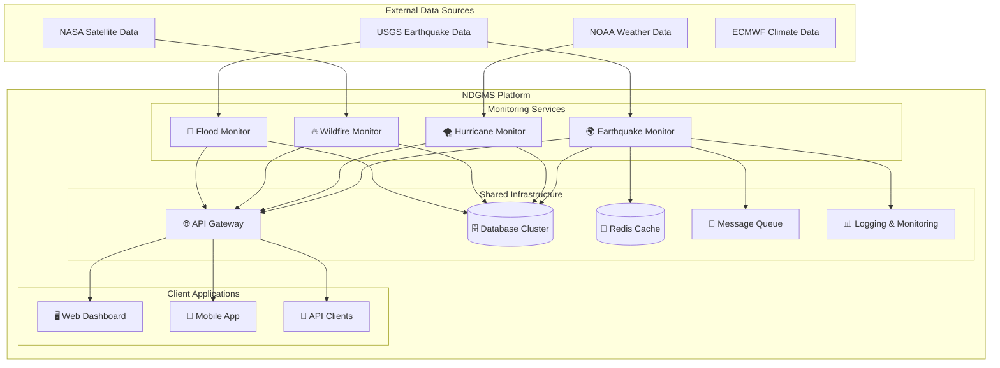
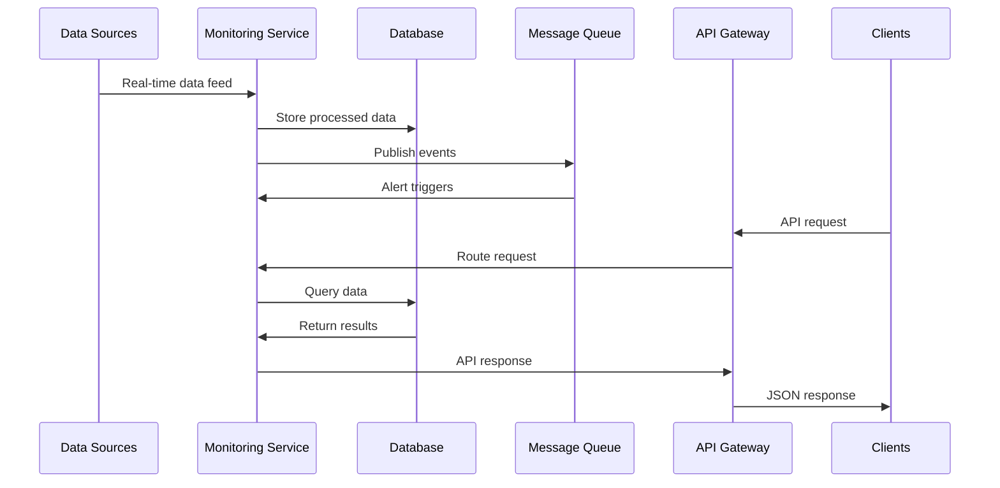

# 🌍 NDGMS - Natural Disaster Global Monitoring System

A comprehensive, scalable platform for monitoring and analyzing natural disasters worldwide. Built with modern microservices architecture, NDGMS provides real-time data ingestion, analysis, and alerting for various types of natural disasters.


## 🎯 Mission

To provide a unified, real-time monitoring platform that ingests, processes, and analyzes natural disaster data from multiple sources worldwide, enabling rapid response and informed decision-making for disaster management organizations.

## 🚀 System Overview

NDGMS is designed as a modular microservices platform where each natural disaster type has its dedicated monitoring service. This architecture ensures:

- **🔧 Scalability**: Each service can be scaled independently
- **🛡️ Resilience**: Failure in one service doesn't affect others
- **🔄 Flexibility**: Easy to add new disaster types or data sources
- **⚡ Performance**: Optimized processing for each disaster type

## 🌐 Active Monitoring Services

### 🌊 **Earthquake Monitor** `[PRODUCTION READY]`
Real-time earthquake monitoring with USGS data integration.

- **📍 Location**: [`/earthquake-monitor`](./earthquake-monitor/)
- **🌍 Coverage**: Global earthquake monitoring
- **📊 Data Sources**: USGS, custom seismic networks
- **⚡ Features**:
  - Real-time USGS data ingestion
  - WebSocket live updates
  - Advanced filtering with PostGIS spatial queries
  - OAuth2 secure API
  - Clean Architecture implementation

### 🌪️ **Hurricane Monitor** `[PLANNED]`
Tropical cyclone and hurricane tracking system.

- **📍 Location**: [`/hurricane-monitor`](./hurricane-monitor/)
- **🌍 Coverage**: Atlantic, Pacific, Indian Ocean basins
- **📊 Data Sources**: NOAA, JMA, ECMWF
- **⚡ Features**: Storm tracking, intensity prediction, landfall analysis

### 🔥 **Wildfire Monitor** `[PLANNED]`
Forest fire detection and monitoring system.

- **📍 Location**: [`/wildfire-monitor`](./wildfire-monitor/)`
- **🌍 Coverage**: Global satellite coverage
- **📊 Data Sources**: NASA FIRMS, Sentinel satellites, MODIS
- **⚡ Features**: Satellite detection, fire progression, air quality impact

### 🌊 **Flood Monitor** `[PLANNED]`
River, coastal, and flash flood monitoring.

- **📍 Location**: [`/flood-monitor`](./flood-monitor/)`
- **🌍 Coverage**: Major river basins and coastal areas
- **📊 Data Sources**: USGS water data, weather stations, satellite imagery
- **⚡ Features**: Water level monitoring, precipitation correlation, risk assessment

## 🏗️ Architecture

### **Microservices Architecture**



### **Technology Stack**

| Component | Technology | Purpose |
|-----------|------------|---------|
| **Backend Services** | FastAPI + Python 3.12+ | High-performance async APIs |
| **Database** | PostgreSQL + PostGIS | Geospatial data storage |
| **Caching** | Redis | High-speed data caching |
| **Message Queue** | RabbitMQ / Apache Kafka | Event-driven communication |
| **API Gateway** | Kong / Traefik | Request routing and load balancing |
| **Monitoring** | Prometheus + Grafana | Metrics and observability |
| **Logging** | ELK Stack | Centralized logging |
| **Containerization** | Docker + Kubernetes | Container orchestration |
| **CI/CD** | GitHub Actions | Automated testing and deployment |

### **Data Flow Architecture**



## 🚀 Quick Start

### **Prerequisites**
- Docker & Docker Compose
- Python 3.12+ (for local development)
- PostgreSQL 15+ (or use Docker)
- Redis (or use Docker)

### **1. Clone the Repository**
```bash
git clone https://github.com/L3pereira/ndgms.git
cd ndgms
```

### **2. Start Core Infrastructure**
```bash
# Start shared services (database, cache, etc.)
docker-compose -f docker-compose.infrastructure.yml up -d
```

### **3. Start Monitoring Services**
```bash
# Start earthquake monitoring (production ready)
cd earthquake-monitor
docker-compose up -d

# Verify service health
curl http://localhost:8000/health
```

### **4. Access Services**
- **🌍 Earthquake API**: http://localhost:8000/docs
- **📊 Monitoring Dashboard**: http://localhost:3000
- **📈 Metrics**: http://localhost:9090 (Prometheus)
- **📊 Analytics**: http://localhost:3001 (Grafana)

## 📚 Documentation

### **Service Documentation**
- **[🌍 Earthquake Monitor](./earthquake-monitor/README.md)** - Complete earthquake monitoring API
- **[🌪️ Hurricane Monitor](./hurricane-monitor/README.md)** - *Coming Soon*
- **[🔥 Wildfire Monitor](./wildfire-monitor/README.md)** - *Coming Soon*
- **[🌊 Flood Monitor](./flood-monitor/README.md)** - *Coming Soon*

### **Platform Documentation**
- **[🏗️ Architecture Guide](./docs/architecture.md)** - System design and patterns
- **[🚀 Deployment Guide](./docs/deployment.md)** - Production deployment
- **[🔧 Development Guide](./docs/development.md)** - Local development setup
- **[📊 Monitoring Guide](./docs/monitoring.md)** - Observability and alerts
- **[🔒 Security Guide](./docs/security.md)** - Security best practices

### **API Documentation**
- **[📖 API Standards](./docs/api-standards.md)** - Consistent API design
- **[🔑 Authentication](./docs/authentication.md)** - OAuth2 implementation
- **[📋 Rate Limiting](./docs/rate-limiting.md)** - API usage limits
- **[📝 Changelog](./docs/changelog.md)** - Version history

## 🌟 Features

### **Core Platform Features**
- **🔄 Real-time Data Ingestion** - Continuous monitoring from multiple sources
- **🔒 Unified Authentication** - OAuth2 JWT across all services
- **📊 Comprehensive APIs** - RESTful APIs with WebSocket support
- **🌐 Global Coverage** - Worldwide disaster monitoring
- **⚡ High Performance** - Async processing and optimized databases
- **📈 Scalable Architecture** - Microservices with horizontal scaling

### **Monitoring Capabilities**
- **🎯 Multi-source Integration** - Government agencies, satellite data, sensors
- **🔍 Advanced Filtering** - Magnitude, location, time, severity filters
- **📍 Geospatial Analysis** - PostGIS-powered location queries
- **⏰ Real-time Alerts** - WebSocket and webhook notifications
- **📊 Historical Analysis** - Long-term trend analysis and reporting
- **🤖 Machine Learning** - Predictive analytics and pattern recognition

### **Developer Experience**
- **📖 Interactive Documentation** - Swagger/OpenAPI for all services
- **🐳 Docker Support** - Full containerization
- **🧪 Comprehensive Testing** - Unit, integration, and end-to-end tests
- **🔧 Developer Tools** - Linting, formatting, type checking
- **🚀 CI/CD Pipeline** - Automated testing and deployment
- **📊 Monitoring & Observability** - Prometheus metrics and structured logging

## 🗂️ Repository Structure

```
ndgms/
├── 📁 earthquake-monitor/      # Earthquake monitoring service [ACTIVE]
│   ├── src/                    # Source code (Clean Architecture)
│   ├── tests/                  # Comprehensive test suite
│   ├── docker/                 # Docker configurations
│   ├── docs/                   # Service-specific documentation
│   └── README.md               # Service documentation
├── 📁 hurricane-monitor/       # Hurricane monitoring service [PLANNED]
├── 📁 wildfire-monitor/        # Wildfire monitoring service [PLANNED]
├── 📁 flood-monitor/           # Flood monitoring service [PLANNED]
├── 📁 shared/                  # Shared libraries and utilities
│   ├── auth/                   # Common authentication
│   ├── database/               # Database utilities
│   ├── monitoring/             # Observability tools
│   └── schemas/                # Common data schemas
├── 📁 infrastructure/          # Infrastructure as Code
│   ├── kubernetes/             # K8s manifests
│   ├── terraform/              # Cloud infrastructure
│   └── monitoring/             # Prometheus, Grafana configs
├── 📁 docs/                    # Platform documentation
├── 📁 scripts/                 # Deployment and utility scripts
├── 📁 clients/                 # API client libraries
│   ├── python/                 # Python SDK
│   ├── javascript/             # JS/TS SDK
│   └── go/                     # Go SDK
└── docker-compose*.yml        # Docker orchestration
```

## 🔧 Development

### **Local Development Setup**

1. **Clone and setup**:
```bash
git clone https://github.com/your-org/ndgms.git
cd ndgms

# Setup shared environment
cp .env.example .env
```

2. **Start infrastructure**:
```bash
# Start databases, cache, message queue
docker-compose -f docker-compose.infrastructure.yml up -d
```

3. **Develop a specific service**:
```bash
cd earthquake-monitor
python -m venv .venv
source .venv/bin/activate
pip install -r requirements.txt
uvicorn src.presentation.main:app --reload
```

### **Testing Strategy**

```bash
# Run all service tests
make test-all

# Test specific service
cd earthquake-monitor && pytest

# Integration tests across services
make test-integration

# Performance tests
make test-performance
```

### **Code Quality Standards**

- **🎯 Clean Architecture** - Consistent across all services
- **📝 Documentation** - Comprehensive API documentation
- **🧪 Testing** - 95%+ test coverage requirement
- **🔍 Type Safety** - Full type hints with mypy
- **📏 Code Style** - Black, isort, ruff compliance
- **🔒 Security** - OWASP security practices

## 🚀 Deployment

### **Development Environment**
```bash
# Local development with hot reload
docker-compose -f docker-compose.dev.yml up
```

### **Staging Environment**
```bash
# Staging environment for testing
docker-compose -f docker-compose.staging.yml up
```

### **Production Environment**
```bash
# Production deployment with monitoring
docker-compose -f docker-compose.prod.yml up -d

# Or using Kubernetes
kubectl apply -f infrastructure/kubernetes/
```

### **Cloud Deployment**
- **☁️ AWS**: ECS/EKS with RDS and ElastiCache
- **☁️ Google Cloud**: GKE with Cloud SQL and Memorystore
- **☁️ Azure**: AKS with Azure Database and Redis Cache
- **🌐 Multi-cloud**: Terraform configurations for all providers

## 📊 Monitoring & Observability

### **Health Monitoring**
- **🔍 Service Health Checks** - Individual service health endpoints
- **💓 System Health Dashboard** - Overall platform status
- **📈 Performance Metrics** - Response times, throughput, error rates
- **🚨 Alerting** - PagerDuty/Slack integration for critical issues

### **Logging & Tracing**
- **📝 Structured Logging** - JSON logs with correlation IDs
- **🔍 Distributed Tracing** - Request flow across services
- **📊 Log Aggregation** - ELK stack for centralized logging
- **🔎 Search & Analytics** - Kibana dashboards for log analysis

### **Business Metrics**
- **📊 Data Volume** - Events processed per minute/hour
- **⏱️ Latency** - End-to-end data ingestion time
- **🎯 Accuracy** - Data quality and validation metrics
- **👥 Usage** - API usage patterns and client behavior

## 🤝 Contributing

We welcome contributions to NDGMS! Whether you're fixing bugs, adding features, or improving documentation, your help is appreciated.

### **Contributing Guidelines**

1. **🍴 Fork** the repository and create a feature branch
2. **📋 Follow** our coding standards and architecture patterns
3. **🧪 Write** comprehensive tests for new features
4. **📝 Document** your changes and update relevant documentation
5. **✅ Ensure** all tests pass and code quality checks succeed
6. **📤 Submit** a pull request with a clear description

### **Development Workflow**

```bash
# 1. Fork and clone
git clone https://github.com/L3pereira/ndgms.git
cd ndgms

# 2. Create feature branch
git checkout -b feature/amazing-feature

# 3. Make changes and test
make test-all
make lint

# 4. Commit with conventional commits
git commit -m "feat(earthquake): add magnitude prediction"

# 5. Push and create PR
git push origin feature/amazing-feature
```

### **Code Review Process**

- **👥 Peer Review** - All PRs require review from maintainers
- **🧪 Automated Testing** - CI pipeline must pass
- **📊 Coverage Check** - Maintain 95%+ test coverage
- **🔒 Security Review** - Security implications assessment
- **📝 Documentation** - Update docs for new features

## 🛣️ Roadmap

### **Phase 1: Foundation (Q1 2024)** ✅
- [x] 🌍 Earthquake monitoring service (production ready)
- [x] 🏗️ Core infrastructure and architecture
- [x] 🔒 Authentication and security framework
- [x] 📊 Basic monitoring and observability
- [x] 🐳 Docker containerization

### **Phase 2: Expansion (Q2 2024)** 🚧
- [ ] 🌪️ Hurricane monitoring service
- [ ] 🔥 Wildfire monitoring service
- [ ] 🌐 API Gateway implementation
- [ ] 📱 Mobile app development
- [ ] 🤖 Basic ML models for prediction

### **Phase 3: Intelligence (Q3 2024)** 📅
- [ ] 🌊 Flood monitoring service
- [ ] 🧠 Advanced AI/ML analytics
- [ ] 🔔 Smart alerting system
- [ ] 📊 Advanced visualization dashboard
- [ ] 🌍 Multi-language support

### **Phase 4: Scale (Q4 2024)** 📅
- [ ] ☁️ Multi-cloud deployment
- [ ] 🔄 Event sourcing architecture
- [ ] 📈 Real-time analytics platform
- [ ] 🤝 Third-party integrations
- [ ] 📚 Developer ecosystem

## 📈 Performance & Scale

### **Current Performance**
- **⚡ Response Time**: < 100ms for 95% of requests
- **📊 Throughput**: 10,000+ requests/second per service
- **💾 Data Volume**: 1M+ earthquake records with sub-second queries
- **🌐 Availability**: 99.9% uptime with health monitoring

### **Scalability Targets**
- **📈 Horizontal Scaling**: 100+ service instances
- **🌍 Global Distribution**: Multi-region deployment
- **📊 Data Volume**: 100M+ disaster events
- **👥 Concurrent Users**: 100,000+ simultaneous connections

## 🔒 Security

### **Security Measures**
- **🔑 OAuth2 Authentication** - JWT tokens with refresh mechanism
- **🛡️ HTTPS/TLS** - End-to-end encryption
- **🔒 API Rate Limiting** - DDoS protection
- **🚫 Input Validation** - Comprehensive data sanitization
- **📝 Audit Logging** - Complete access audit trail
- **🔐 Secret Management** - Secure configuration management

### **Compliance**
- **📋 GDPR Compliance** - Data privacy and protection
- **🏛️ Government Standards** - FIPS 140-2 encryption
- **🔒 Security Audits** - Regular penetration testing
- **📊 Vulnerability Scanning** - Automated security monitoring

## 📄 License

This project is licensed under the MIT License - see the [LICENSE](LICENSE) file for details.

## 🙏 Acknowledgments

### **Data Providers**
- **[USGS](https://earthquake.usgs.gov/)** - United States Geological Survey
- **[NOAA](https://www.noaa.gov/)** - National Oceanic and Atmospheric Administration
- **[NASA](https://www.nasa.gov/)** - National Aeronautics and Space Administration
- **[ECMWF](https://www.ecmwf.int/)** - European Centre for Medium-Range Weather Forecasts

### **Technology Partners**
- **[FastAPI](https://fastapi.tiangolo.com/)** - Modern Python web framework
- **[PostgreSQL](https://www.postgresql.org/)** - Advanced open source database
- **[Docker](https://www.docker.com/)** - Containerization platform
- **[Kubernetes](https://kubernetes.io/)** - Container orchestration

### **Community**
Special thanks to all contributors, testers, and users who help make NDGMS better every day.

---

## 📞 Contact & Support

- **📧 Email**: [contact@ndgms.org](mailto:contact@ndgms.org)
- **💬 Discord**: [NDGMS Community](https://discord.gg/ndgms)
- **🐛 Issues**: [GitHub Issues](https://github.com/L3pereira/ndgms/issues)
- **📖 Documentation**: [docs.ndgms.org](https://docs.ndgms.org)
- **📈 Status Page**: [status.ndgms.org](https://status.ndgms.org)

---

**🌍 Monitoring the Earth, Protecting Lives**

*Built with ❤️ by the NDGMS Team*
